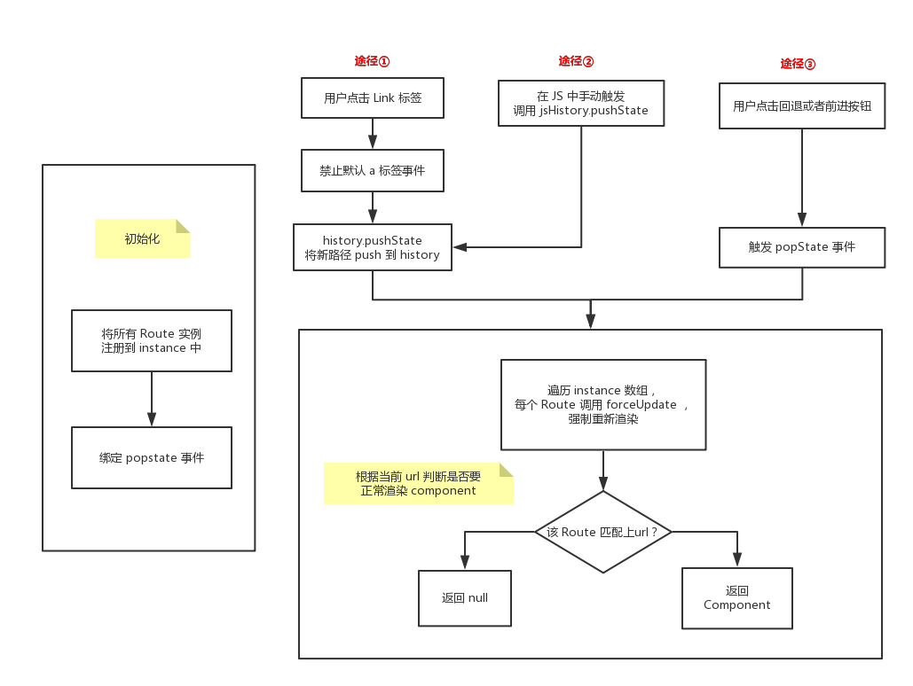

# React Router

React Router 是一个构建在 React 之上的强大的路由库，它有助于向应用程序添加新的 Screen 和 Stream。这使 URL 与网页显示的数据保持同步。它负责维护标准化的结构和行为，并用于开发单页 Web 应用。

React Router v4 基于 Lerna 管理多个 Repository

> - react-router React Router 核心仓库
> - react-router-dom 用于 DOM 绑定的 React Router
> - react-router-native 用于 React Native 的 React Router
> - react-router-redux React Router 和 Redux 集成
> - react-router-config 静态路由配置帮助助手

## 插件初插入

- react-router
- react-router-dom 比前者多了 `<Link>` `<BrowserRouter>` 这样的 DOM 类组件

如果搭配 Redux 还需要 `react-router-redux`

## 基本组件

- router 组件（`<BrowserRouter>`、`<HashRouter>`）
- route matching 组件（`<Route>`、`<Switch>`）
- navigation 组件（`<Link>`、`<NavLink>`）

### Router

Router 时所有路由组件共用的底层接口，一般我们的应用不会使用这个接口，而是使用高级的路由

- `<BrowserRouter/>` 使用 HTML5 提供的 history API 保持 UI 和 URL 同步
- `<HashRouter/>` 使用 URL 的 hash 保持 UI 和 URL 的同步
- `<MemoryRouter>` 能在内存保存你 "URL" 的历史记录（并没有地址栏读写）
- `<NativeRouter>` 为使用 React Native 提供路由支持
- `<StaticRouter>` 从不会改变地址

> ⚠️ 与之前的 Router 不一样，这里 `<Router>` 组件下只允许存在一个字元素，如果存在多个则会报错。

### 路由匹配

- `<Route>`
- `<Switch>`

`<Route>` 组件有如下属性：

| 属性   | 说明                                                            | 类型   |
| ------ | --------------------------------------------------------------- | ------ |
| path   | 路由匹配路径（没有 path 属性的 `<Route>` 总是会匹配）           | string |
| exact  | 为 `true` 时，则要求路径与 `location.pathname` 必须**完全匹配** | bool   |
| strict | 为 `true` 的时候，有**结尾斜线**的路径只能匹配有斜线的          | bool   |

**exact 配置：**

| 路径 | location.pathname | exact | 是否匹配 |
| ---- | ----------------- | ----- | -------- |
| /one | /one/two          | true  | 否       |
| /one | /one/two          | false | 是       |

**strict 配置：**

| 路径  | location.pathname | strict | 是否匹配 |
| ----- | ----------------- | ------ | -------- |
| /one/ | /one              | true   | 否       |
| /one/ | /one/             | true   | 是       |
| /one/ | /one/two          | true   | 是       |

路由匹配是通过将 `<Route>` 组件的 path 属性与当前的 location 的 pathname 进行比较来完成的。当一个 `<Route>` 匹配了，它所对应的组件内容将被渲染出来。 不匹配，则渲染 null。如果一个 `<Route>` 没有 path 属性，他的组件对应内容将一直被渲染出来。

```jsx
// 当 location = { pathname: '/about' }

// 路径匹配成功，渲染 <About/> 组件
<Route path='/about' component={About}/>
// 路径不匹配，渲染 null
<Route path='/contact' component={Contact}/>
// 该组件没有path属性，其对应的 <Always/> 组件会一直渲染
<Route component={Always}/>
```

我们可以在组件树的任何位置放置 `<Route>` 组件。但是更常见的情况是将几个 `<Route>` 写在一起。`<Switch>` 组件可以用来将多个 `<Route>` 包裹”在一起。

多个组件在一起使用时，并不强制要求使用 `<Switch>` 组件，但是使用 `<Switch>` 组件却是非常便利的。`<Switch>` 会迭代它下面的所有 `<Route>` 子组件，并只渲染第一个路径匹配的 `<Route>`。

```jsx
<Switch>
  <Route exact path="/" component={Home} />
  <Route path="/about" component={About} />
  <Route path="/contact" component={Contact} />
</Switch>

<Switch>
  <Route exact path="/" component={Home} />
  <Route path="/about" component={About} />
  <Route path="/contact" component={Contact} />
  {/* 如果上面的Route的路径都没有匹配上，则 <NoMatch>被渲染，我们可以在此组件中返回404 */}
  <Route component={NoMatch} />
</Switch>
```

### Route Rendering Props

- `component` 在地址匹配的时候 React 的组件才会被渲染，route props 也会随着一起被渲染
- `render` 这种方式对于内联渲染和包装组件却不引起意料之外的重新挂载特别方便
- `children` 与 render 属性的工作方式基本一样，除了它是不管地址匹配与否都会被调用

**component**

```jsx
<Route path="/user/:username" component={User} />;

function User({ match }) {
  return <h1>Hello {match.params.username}!</h1>;
}
```

> ⚠️ 不要将 component 属性设置为一个函数，然后在其内部渲染组件。这样会导致已经存在的组件被卸载，然后重写创建一个新组件，而不是仅仅对组件进行更新。

**render**

render 方法直接使用一个内联函数来渲染内容。

```jsx
// convenient inline rendering
<Route path="/home" render={() => <div>Home</div>} />
```

`<Route component>` 的优先级要比 `<Route render>` 高，所以不要在同一个 `<Route>` 中同时使用两个属性

### Navigation

- `<Link>` 用于添加 link
- `<NavLink>` 当它的 path 与 location 匹配时，可以自定义其样式表示当前页面位置
- `<Redirect>` 页面重定向，被渲染时将被渲染到该组件 to 属性指定的位置上

## 实现原理

### History 实现



---

**参考资料：**

* [单页面应用路由实现原理：以 React-Router 为例](https://github.com/youngwind/blog/issues/109)

